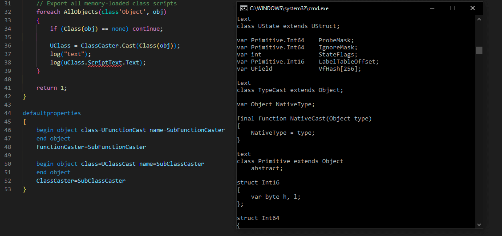

# Unflect

Unflect is a proof-of-concept that exploits the UnrealScript compiler to trick it into compiling an illegal class casting. For example, we can retrieve the values of strictly native fields by casting a UFunction instance into our own mirrored UFunction.



## Compiling

The source is written for Unreal Tournament 2004, but the code should compile for most UE2 games, possibly requiring some minor alignment changes in the native mirror classes.

* Requires /System/[MakeCommandletUtils.u](https://github.com/EliotVU/UnrealScript-MakeCommandletUtils)
* Run `make.bat` (The directory with the `/Classes/` directory has to be located at the root of the UE2 installation e.g. (`C:\\UT2004/Unflect/`).
* Run `test.bat` to confirm that everything's working.

## Usage

### Function Replacement

If you need to replace a function in a class, follow these steps:

* Create a new class that extends the class in which the function you want to replace is located.
* Declare that function in the created class.
* DO NOT change the function declaration and argument types/amount.
* DO NOT create new local variables, as this can cause random crashes. If you need additional variables, make them global and access them using the `class'myNewClass'.default.myNewVariable` syntax.
* If you want to call or override parent code, make sure to always specify the desired parent class name. For example, use `super(TargetClass).PostBeginPlay()` instead of `super.PostBeginPlay()`. This will prevent runaway loop crashes.
* Make your edits to the function's code, and then call the replacement function:

```unrealscript
class'CoreAPI'.static.ReplaceFunction(self, "package.class.targetFunction", "myNewClass.newFunction")
```

Following these steps will help ensure that your code changes are compatible with the rest of the codebase and do not cause unexpected crashes.

### Type Metadata

Works with `int`, `float`, `bool`, `byte`, `string`, `name` types, make sure that your variable name length >= 2 characters.

```unrealscript
var int MyCommentStringProperty "Hello world!";

log("MetaData: " $ class'CoreAPI'.static.GetTypeMetaData(Property'MyCommentStringProperty'));
```

## Derivative works

* [ElitePatch](https://github.com/EliteTrials/ElitePatch) - A UT2004 patch that is activated at run-time on the server and all its clients
